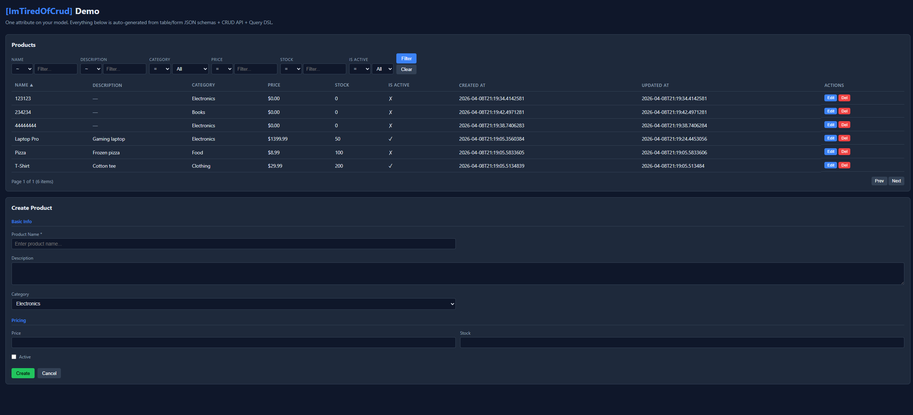

# ZibStack.NET

A collection of .NET source generators and utilities for common application concerns — logging, tracing, DTOs, CRUD APIs, validation, UI metadata, and more. Zero reflection, zero runtime overhead.

**[Documentation](https://mistykuu.github.io/ZibStack.NET/)** | **[Getting Started](https://mistykuu.github.io/ZibStack.NET/getting-started/)** | **[Live Playground](https://zibstack-playground-808858943057.europe-central2.run.app/index.html)**

<a href="https://buymeacoffee.com/mistykuu" target="_blank"></a>

## Three tiers — pick your buy-in

ZibStack is designed so you can adopt as little or as much as you want. Start at Tier 1, move deeper only if it fits your project.

**Tier 1 — Drop-in. Zero architectural buy-in.** Add one attribute, keep everything else unchanged. These work in any .NET 8+ project, solo or team, greenfield or legacy.

- **`[Log]`** — compile-time structured logging with zero boilerplate. Interpolated strings (`LogInformation($"...")`) just work.
- **`[Trace]`** — OpenTelemetry spans on any method, with one attribute. Compatible with Jaeger / Zipkin / OTLP.
- **ZibStack.NET.Aop** — built-in `[Trace]`, `[Log]`, `[Retry]`, `[Cache]`, `[Metrics]`, `[Audit]`, `[Timeout]`, `[Authorize]`, `[Validate]`, `[Transaction]` aspects. Write your own with `IAspectHandler` — a few lines each. Global `Apply<>()` rules to instrument entire namespaces without any attributes.

**Tier 2 — Ergonomics. Opt-in per file.** TypeScript-inspired utility types and helpers you reach for when you want them. No framework, no configuration.

- **TypeScript utility types** — `Partial<T>`, `Pick<T, K>`, `Omit<T, K>`, `Intersect<...>` via source generators.
- **`[Destructurable<T>]`** — JS-style `{ picked, ...rest }` destructuring on a partial shape record: `var (picked, rest) = PersonNameId.Split(person)` (both halves typed).
- **`Result<T>`** — functional error handling with `Map`/`Bind`/`Match`.
- **`[ZValidate]`** — compile-time validation from attributes.

**Tier 3 — Opinionated scaffolding. High buy-in, high payoff.** Full-stack CRUD generation, query DSL, UI metadata. Best for solo projects and small teams where the time savings justify the framework buy-in; be cautious on large enterprise codebases where "magic" can surprise teammates.

- **`[CrudApi]` / `[ImTiredOfCrud]`** — one attribute generates DTOs, endpoints, EF/Dapper stores, validation, query DSL, form/table UI schemas. Add `[SignalRHub]` for real-time push — generated endpoints notify connected clients via `OnCreated`/`OnUpdated`/`OnDeleted`.
- **ZibStack.NET.Query** — filter/sort DSL (`filter=Level>25,Team.Name=*ski`) compiled to LINQ/SQL.
- **ZibStack.NET.UI** — compile-time form/table metadata, consumed by any frontend.

> **Try the Playground** — edit C# models with `[ImTiredOfCrud]` to see generated endpoints, DTOs, query DSL, and form/table schemas update in real-time. The Examples tab auto-generates filter/sort URLs for your model and a **▶ Run** button fires each one against an in-memory mock backend wired through the real `ZibStack.NET.Query` parsers — paste a sample, click Run, see the DSL evaluate live. Hosted on Render's free tier so initial load may be slow — for best experience clone the repo and run locally: `cd packages/ZibStack.NET.UI/sample/SampleApi && dotnet run`

## Why?

**Logging is tedious.** In enterprise systems you need logs everywhere. Wrapping every method in try-catch just for entry/exit logging is boilerplate hell. `[Log]` on a class adds structured logging to every public method — automatic entry, exit, exception, and timing. One attribute, done.

**Structured logging fights you.** `ILogger.LogInformation` requires message templates: `_logger.LogInformation("User {User} bought {Product}", user, product)` — you can't use interpolated strings because they bypass structured logging. With ZibStack.NET.Log, standard `_logger.LogInformation($"User {user}")` just works — a source generator emits compile-time interceptors that dispatch via cached `LoggerMessage.Define<T>` delegates. **~5× faster than Microsoft's standard API, zero allocation** (3.8 ns / 0 B vs 19.1 ns / 104 B).

**Tracing is boilerplate hell.** Instrumenting a method with OpenTelemetry means wrapping every call in `using var activity = ...` + try/catch + `SetStatus` + tag wiring. Do it once, you've tripled the size of the method. With `[Trace]` it's one attribute, and you get consistent parameter tags, status, elapsed time, and exception reporting for free.

**TypeScript has it, C# doesn't.** `Partial<T>`, `Pick<T, K>`, `Omit<T, K>`, intersection types — if you write frontend code, you miss these in C#. Now you can: `[PartialFrom(typeof(Player))]` generates `PatchField<T>` properties with `ApplyTo()` for patching. `[PickFrom]`, `[OmitFrom]`, `[IntersectFrom]` — all source-generated, strongly-typed.

**JS-style destructuring with rest.** `const { name, id, ...rest } = person` is one of the most missed features when moving from JS/TS to C#. Now: declare a partial shape record `[Destructurable<Person>] partial record PersonNameId(string Name, int Id)`, then `var (picked, rest) = PersonNameId.Split(person)` — both `picked` and `rest` are fully typed, IDE-autocompleted, refactor-safe. The shape doubles as a reusable DTO (response/log payload/mapper input), so the cost of one declaration line buys you a named type used in more than just the destructure.

**CRUD is 80% copy-paste.** Define a model, write Create/Update/Response DTOs, wire up endpoints, add validation, build query filters, set up EF stores. Or: `[ImTiredOfCrud]` — one attribute generates everything. CRUD API + DTOs + validation + query DSL (filter/sort/select with OR, grouping, IN, dot notation on relations) + form/table UI schemas with `filterOperators` per column. One attribute, full stack.

## Packages

| Package | NuGet | Description |
|---|---|---|
| [**ZibStack.NET.Aop**](packages/ZibStack.NET.Aop/) | `dotnet add package ZibStack.NET.Aop` | AOP framework with C# interceptors. Built-in: `[Log]`, `[Trace]`, `[Retry]`, `[Cache]`, `[Metrics]`, `[Timeout]`, `[Authorize]`, `[Validate]`, `[Transaction]`. Custom aspects via `IAspectHandler`. Global `Apply<>()` rules. |
| [**ZibStack.NET.Log**](packages/ZibStack.NET.Log/) | `dotnet add package ZibStack.NET.Log` | Interpolated-string logging optimization — rewrites `LogInformation($"...")` into zero-allocation `LoggerMessage.Define` at compile time. Note: `[Log]` attribute has moved to ZibStack.NET.Aop. |
| [**ZibStack.NET.Aop.Polly**](packages/ZibStack.NET.Aop/src/ZibStack.NET.Aop.Polly/) | `dotnet add package ZibStack.NET.Aop.Polly` | Polly-based resilience aspects: `[PollyRetry]` (named pipelines, backoff, exception filtering) and `[PollyHttpRetry]` (transient HTTP errors). |
| [**ZibStack.NET.Aop.HybridCache**](packages/ZibStack.NET.Aop/src/ZibStack.NET.Aop.HybridCache/) | `dotnet add package ZibStack.NET.Aop.HybridCache` | `[HybridCache]` — L1/L2 caching (memory + Redis) via `Microsoft.Extensions.Caching.Hybrid`. |
| [**ZibStack.NET.Core**](packages/ZibStack.NET.Core/) | `dotnet add package ZibStack.NET.Core` | Source generator for shared attributes: relationships (`OneToMany`, `OneToOne`, `Entity`), TypeScript-style utility types (`PartialFrom`, `IntersectFrom`, `PickFrom`, `OmitFrom`), JS-style destructuring (`Destructurable<TSource>` → shape-record + `Split(src)` factory + nested `Rest`). |
| [**ZibStack.NET.Result**](packages/ZibStack.NET.Result/) | `dotnet add package ZibStack.NET.Result` | Functional Result monad (`Result<T>`) with Map/Bind/Match, error handling without exceptions. |
| [**ZibStack.NET.Validation**](packages/ZibStack.NET.Validation/) | `dotnet add package ZibStack.NET.Validation` | Source generator for compile-time validation from attributes (`[ZRequired]`, `[ZEmail]`, `[ZRange]`, `[ZMatch]`). |
| [**ZibStack.NET.TypeGen**](packages/ZibStack.NET.TypeGen/) | `dotnet add package ZibStack.NET.TypeGen` | Roslyn source generator that emits **TypeScript interfaces**, **OpenAPI 3.0** schemas, **Pydantic v2** models, **Zod schemas** and **GraphQL types** from C# DTOs annotated with `[GenerateTypes]`. Compile-time, zero reflection, no running app required — `dotnet build` writes the `.ts` / `.yaml` / `.py` / `.schema.ts` / `.graphql` files directly to your configured output directory. |
| [**ZibStack.NET.Dto**](packages/ZibStack.NET.Dto/) | `dotnet add package ZibStack.NET.Dto` | Source generator for CRUD DTOs (Create/Update/Response/Query) with PatchField support and full CRUD API generation. |
| [**ZibStack.NET.Query**](packages/ZibStack.NET.Query/) | `dotnet add package ZibStack.NET.Query` | Filter/sort DSL for REST APIs. Parses query strings (`filter=Level>25,Team.Name=*ski&sort=-Level`) into LINQ/SQL. Compile-time field allowlists via source generation. |
| [**ZibStack.NET.EntityFramework**](packages/ZibStack.NET.EntityFramework/) | `dotnet add package ZibStack.NET.EntityFramework` | EF Core integration for Dto CRUD API. Auto-generates stores + DI registration from `DbContext`. |
| [**ZibStack.NET.Dapper**](packages/ZibStack.NET.Dapper/) | `dotnet add package ZibStack.NET.Dapper` | Dapper integration for Dto CRUD API. `DapperCrudStore` base class with auto-generated SQL. |
| [**ZibStack.NET.UI**](packages/ZibStack.NET.UI/) | `dotnet add package ZibStack.NET.UI` | Source generator for UI form/table metadata. Annotate models, get compile-time form descriptors and table column definitions. |

---

## Tier 1 — Drop-in

### ZibStack.NET.Aop — `[Log]`

```csharp
using ZibStack.NET.Aop;

// On a method:
[Log]
public Order PlaceOrder(int customerId, [Sensitive] string creditCard) { ... }
// log: Entering OrderService.PlaceOrder(customerId: 42, creditCard: ***)
// log: Exited OrderService.PlaceOrder in 53ms -> {"Id":1,"Product":"Widget"}

// On a class — logs ALL public methods:
[Log]
public class OrderService { ... }
```

### ZibStack.NET.Log — Interpolated-string logging

```csharp
// Interpolated string logging — just add the using:
using ZibStack.NET.Log;

logger.LogInformation($"User {userId} bought {product} for {total:C}");
// Intercepted at compile time → cached LoggerMessage.Define<int, string, decimal>
// ~5× faster than Microsoft's LogInformation("template", args), zero allocation:
//
//   $"..." (level OFF):  3.2 ns, 0 B    vs  Microsoft: 15.7 ns, 104 B
//   $"..." (level ON):   3.8 ns, 0 B    vs  Microsoft: 19.1 ns, 104 B

// Optional: project-wide defaults via fluent configurator (default: Information level, Destructure mode)
public sealed class LogConfig : ILogConfigurator
{
    public void Configure(ILogBuilder b) => b.Defaults(d =>
    {
        d.EntryExitLevel = ZibLogLevel.Debug;
        d.ObjectLogging = ObjectLogMode.Json;
    });
}
```

> **Quiet by default.** ZibStack.NET.Log doesn't force a global using and the interpolated-logging suggestion (`ZLOG002`) is a hint, not a warning — your existing `LogInformation("...", arg)` call sites stay untouched. If you want the opinionated experience (global using + warnings on every legacy call site), opt in with `<ZibLogStrict>true</ZibLogStrict>` in your `.csproj`. See the [Log package docs](https://mistykuu.github.io/ZibStack.NET/packages/log/#configuration) for individual toggles.

### ZibStack.NET.Aop — built-in aspects + custom aspects

```csharp
// Built-in aspects — all registered by AddAop(), just apply:
[Trace]                                                          // OpenTelemetry spans
[Retry(MaxAttempts = 3, Handle = new[] { typeof(HttpRequestException) })]  // retry with filtering
[Cache(KeyTemplate = "order:{id}", DurationSeconds = 60)]        // in-memory cache
[Metrics]                                                        // call count + duration + errors
public async Task<Order> GetOrderAsync(int id) { ... }

[Timeout(TimeoutMs = 5000)]                                      // async execution time limit
public async Task<Report> GenerateReportAsync(int id) { ... }

[Authorize(Roles = "Admin")]                                     // role/policy-based auth
public async Task DeleteOrderAsync(int id) { ... }
```

Write your own aspects — just a class + attribute:

```csharp
[AspectHandler(typeof(TimingHandler))]
public class TimingAttribute : AspectAttribute { }

public class TimingHandler : IAspectHandler
{
    public void OnBefore(AspectContext ctx)
        => Console.WriteLine($"Starting {ctx.MethodName}({ctx.FormatParameters()})");
    public void OnAfter(AspectContext ctx)
        => Console.WriteLine($"Completed {ctx.MethodName} in {ctx.ElapsedMilliseconds}ms");
    public void OnException(AspectContext ctx, Exception ex)
        => Console.WriteLine($"Failed {ctx.MethodName}: {ex.Message}");
}
```

Setup — one-liner:

```csharp
builder.Services.AddAop();           // registers all built-in handlers
builder.Services.AddTransient<TimingHandler>();  // your own

var app = builder.Build();
app.Services.UseAop();               // bridges DI into the aspect runtime
```

**Compile-time analyzers + code fixes (bundled, no extra install):**
32 Roslyn diagnostics catch broken aspect placements before you build —
`[Cache]` on a `void` method, `[Retry(MaxAttempts = 0)]`, `[Log]` on a
`private` method, method group conversions that bypass the interceptor,
`base.Method()` calls that recurse infinitely, plus argument validation
for the optional Polly + HybridCache packages
(`[PollyRetry(MaxRetryAttempts = 0)]`, `[PollyCircuitBreaker(FailureThreshold = 1.5)]`,
`[HybridCache(DurationSeconds = -1)]` — all caught at compile time).
Plus a set of declarative architecture rules: `[RequireAspect(typeof(LogAttribute))]`,
`[RequireImplementation(typeof(IDisposable))]`, `[RequireMethod("Configure")]`,
`[RequireConstructor(typeof(IServiceProvider))]`, `[ScopeTo("MyApp.Internal.**")]`
— declared once on a base or scoped type, enforced everywhere a derivative
or call site exists (same idea as Metalama, scoped to focused attributes).
25 of them ship an Alt+Enter code fix. Full reference:
[docs/packages/aop-analyzers](https://mistykuu.github.io/ZibStack.NET/packages/aop-analyzers/).

---

## Tier 2 — Ergonomics

### ZibStack.NET.Core — `[Destructurable<TSource>]`

```csharp
// Source — plain record, no attributes here.
public record Person(string Name, int Id, string Email, int Age, string City);

// Shape — partial record listing the picked properties.
[Destructurable<Person>]
public partial record PersonNameId(string Name, int Id);

// Generator emits on PersonNameId:
//   public sealed record Rest(string Email, int Age, string City);
//   public static PersonNameId FromSource(Person src);
//   public static Rest         RestOf(Person src);
//   public static (PersonNameId Picked, Rest Remaining) Split(Person src);

var person = new Person("Alice", 42, "a@b.c", 30, "Warsaw");
var (picked, rest) = PersonNameId.Split(person);

// picked.Name = "Alice", picked.Id = 42       — both typed
// rest.Email  = "a@b.c", rest.Age = 30, rest.City = "Warsaw"  — typed, IDE-autocompleted
```

**Why a shape record (and not a lambda or method-name encoding)?** Anonymous types in C# are nominal, not structural — they have no source-writable name a generator can emit code against, and the C# language team has explicitly declined both [anonymous-type deconstruction](https://github.com/dotnet/csharplang/discussions/244) and [spread/rest object syntax](https://github.com/dotnet/csharplang/discussions/7507). The shape record carries the shape in a *named* type, which lets the generator hand you a typed `Rest` back. The shape is also reusable as a regular DTO — no throwaway anon, no `dynamic`, no untyped dictionary.

### ZibStack.NET.Result

```csharp
public Result<Order> GetOrder(int id)
{
    if (id <= 0) return Result<Order>.Failure(Error.Validation("Invalid ID"));
    var order = _repo.Find(id);
    return order is null ? Result<Order>.Failure(Error.NotFound("Order not found"))
                         : Result<Order>.Success(order);
}

// Usage with Map/Bind/Match:
var result = GetOrder(42)
    .Map(o => o.Total)
    .Match(
        onSuccess: total => $"Total: {total}",
        onFailure: error => $"Error: {error.Message}");
```

### ZibStack.NET.Validation

```csharp
[ZValidate]
public partial class CreateUserRequest
{
    [ZRequired] [ZMinLength(2)] public string Name { get; set; } = "";
    [ZRequired] [ZEmail]        public string Email { get; set; } = "";
    [ZRange(18, 120)]          public int Age { get; set; }
    [ZMatch(@"^\+?\d{7,15}$")] public string? Phone { get; set; }
}

// Generated Validate() method:
var result = request.Validate();
if (!result.IsValid) return BadRequest(result.Errors);
```

---

## Tier 3 — Opinionated scaffolding

> **Before you adopt Tier 3:** these generators move a lot of code out of your hands. On solo or small-team projects the time savings are massive. On larger teams where everyone needs to understand the generated code, start with Tier 1 — adopt Tier 3 only when the whole team has seen how it works. The [Playground](https://zibstack-playground-808858943057.europe-central2.run.app/index.html) is the fastest way to show teammates what's generated.

### ZibStack.NET.Dto

```csharp
// One attribute = full CRUD API with auto-generated DTOs + endpoints:
[CrudApi(SoftDelete = true)]   // SoftDelete = true → PATCH /archive + /restore instead of hard DELETE
public class Player
{
    [DtoIgnore(DtoTarget.Create | DtoTarget.Update | DtoTarget.Query)]
    public int Id { get; set; }
    public required string Name { get; set; }
    public int Level { get; set; }
    public string? Email { get; set; }

    [DtoOnly(DtoTarget.Create)]     public required string Password { get; set; }
    [DtoIgnore(DtoTarget.Response)] public DateTime CreatedAt { get; set; }
}

// Test scaffolding — generates xUnit CRUD integration tests for every [CrudApi] entity:
[assembly: GenerateCrudTests]

// EF Core — auto-generated stores from DbContext:
[GenerateCrudStores]
public class AppDbContext : DbContext
{
    public DbSet<Player> Players => Set<Player>();
}

// Program.cs — three lines:
builder.Services.AddDbContext<AppDbContext>(o => o.UseSqlite("Data Source=app.db"));
builder.Services.AddAppDbContextCrudStores();   // auto-generated DI registration
app.MapPlayerEndpoints();                        // auto-generated GET/POST/PATCH/DELETE
```

### ZibStack.NET.Query

```csharp
// Add ZibStack.NET.Query to your project — the Dto generator auto-detects it
// and adds filter/sort string params to all CRUD list endpoints:

GET /api/players?filter=Level>25,Name=*ski&sort=-Level&page=1&pageSize=20
GET /api/players?filter=Team.Name=Lakers                    // relation → auto JOIN
GET /api/players?filter=(Level>50|Level<10),Team.City=LA    // OR + grouping
GET /api/players?filter=Name=in=Jan;Anna;Kasia              // IN list
GET /api/players?filter=Email=*@test.pl/i&sort=Team.Name    // case insensitive + relation sort
GET /api/teams?filter=Players.Name=*ski                     // OneToMany → filter by child properties
GET /api/players?filter=Level>25&count=true                 // count only → { "count": 42 }
GET /api/players?select=Name,Level,Team.Name                // field selection

// [QueryDto] — standalone query DSL attribute, Sortable defaults to true
// Operators: = != > >= < <= =* !* ^ !^ $ !$ =in= =out=
// Logic: , (AND) | (OR) () (grouping) /i (case insensitive)
```

### ZibStack.NET.UI

```csharp
// Annotate models for forms + tables — generates JSON metadata at compile time:
[UiForm]
[UiTable(DefaultSort = "Name", SchemaUrl = "/api/tables/player")]
[UiFormGroup("basic", Label = "Basic Info", Order = 1)]
public partial class PlayerView
{
    [UiFormIgnore]
    [UiTableColumn(IsVisible = false)]
    public int Id { get; set; }

    [ZRequired] [ZMinLength(2)]
    [UiFormField(Label = "Name", Placeholder = "Enter name...", Group = "basic")]
    [UiTableColumn(Sortable = true, Filterable = true)]
    public required string Name { get; set; }

    [Select(typeof(Region))]
    [UiFormField(Label = "Region", Group = "basic")]
    [UiTableColumn(Sortable = true, Filterable = true)]
    public Region Region { get; set; }

    [Slider(Min = 1, Max = 100)]
    [UiFormField(Label = "Level", Group = "basic")]
    [UiTableColumn(Sortable = true)]
    public int Level { get; set; }
}

// Generated: PlayerViewFormDescriptor, PlayerViewTableDescriptor, PlayerViewJsonSchema
// → Consume from Blazor, React, Vue, Angular — framework-agnostic JSON metadata
```

### `[ImTiredOfCrud]` — one attribute, full-stack CRUD

The capstone. One attribute on your model generates: CRUD API + DTOs + validation + form/table UI schemas + Query DSL (filter, sort, select, pagination). The frontend reads the JSON schemas and renders everything automatically — zero configuration.



## Repository Structure

```
ZibStack.NET/
├── packages/
│   ├── ZibStack.NET.Aop/              → AOP framework (all aspects: [Log]/[Trace]/[Retry]/[Cache]/[Metrics]/... + Apply<>())
│   │   └── ZibStack.NET.Aop.Polly/   → Polly-based resilience ([PollyRetry], [HttpRetry])
│   ├── ZibStack.NET.Log/              → Interpolated-string logging optimization
│   ├── ZibStack.NET.Core/             → Shared attributes (relations, utility types)
│   ├── ZibStack.NET.Dto/              → DTO + CRUD API source generator
│   ├── ZibStack.NET.Query/            → Filter/sort DSL for REST APIs
│   ├── ZibStack.NET.EntityFramework/  → EF Core integration for Dto CRUD
│   ├── ZibStack.NET.Dapper/           → Dapper integration for Dto CRUD
│   ├── ZibStack.NET.Result/           → Result monad (Map/Bind/Match)
│   ├── ZibStack.NET.Validation/       → Validation source generator
│   └── ZibStack.NET.UI/               → UI form/table metadata generator
├── .github/workflows/
│   ├── ci.yml                         → Builds & tests all packages
│   ├── release-all.yml                → Release all packages to NuGet
│   └── release-{package}.yml          → Individual package releases
└── ZibStack.NET.slnx
```

## License

MIT
